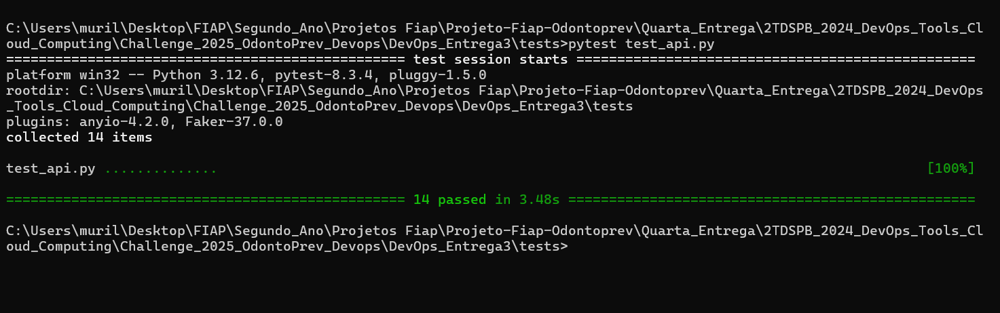

# Challenge DevOps - OdontoPrev

## Integrantes

- **Murilo Ferreira Ramos** - RM553315  
- **Pedro Luiz Prado** - RM553874  
- **William Kenzo Hayashi** - RM552659

---

## Distribuição de Atividades

A divisão das atividades foi realizada conforme as disciplinas da grade curricular:

- **Murilo**: DevOps Tools, Cloud Computing, Compliance, Quality Assurance, e Tests.
- **Pedro**: Mobile Application Development, e Advanced Business Development With .NET, Disruptive Architectures IoT, IOB, Generative AI
- **William**: Java Advanced, Mastering Relational e Non-Relational Database

---

## Link do Vídeo de Apresentação

- [Link do Vídeo no YouTube](https://www.youtube.com/watch?v=60iEipKjBGI)

---

## Documentação Completa

A documentação técnica detalhada do projeto, incluindo arquitetura, banco de dados, fluxos de requisição e prints está disponível na pasta [`docs`](docs/).

---

## 🌐 Aplicação em Produção (Azure Web App)

A aplicação está publicada e acessível pelo link:  
🔗 [`https://app-odontoprev-python-rm553315.azurewebsites.net/`](https://app-odontoprev-python-rm553315.azurewebsites.net/)

---

## 🚀 Pipeline CI/CD (Azure DevOps)

Utilizamos o Azure DevOps com duas pipelines:

- **CI (Continuous Integration)**: Executa testes com `pytest` a cada commit na `main`.
- **CD (Continuous Deployment)**: Realiza o deploy automático no Azure App Service.

Arquivos usados:
- `azure-pipelines.yml`: Pipeline completa de CI/CD. Faz build da imagem Docker, push no ACR, cria infraestrutura e publica a aplicação.
- `azure-deploy.yml`: Pipeline de deploy manual. Cria infraestrutura e realiza o deploy de uma imagem Docker existente no ACR.

## ☁️ Infraestrutura como Código (IaC)

Toda a infraestrutura necessária para a aplicação é provisionada automaticamente via pipeline de deploy (CD), utilizando comandos `Azure CLI` no próprio `azure-pipelines.yml`.

A infraestrutura criada inclui:
- Resource Group (`rg-appinfra-553315`)
- Azure Container Registry (ACR) (`acrsqldbrm553315`)
- Azure App Service Plan (`plan-odontoprev-python-553315`)
- Web App Linux com Docker Container (`app-odontoprev-python-rm553315`)

A imagem Docker é gerada, enviada ao ACR e referenciada automaticamente no App Service, conectando-se ao banco SQL já existente no resource group externo.

## 🔐 Variáveis de Ambiente

A aplicação é configurada com variáveis de ambiente no Azure App Service, como:

- `WEBSITES_PORT=8000`  
- `DB_HOST=servidor-sqldb-rm553315.database.windows.net`  
- `DB_NAME=db-odontoprev-553315`  
- `DB_USER=adm-sqldb-dimdim`  
- `DB_PASS=[armazenada de forma segura na pipeline]`

Essas variáveis são aplicadas automaticamente durante o processo de deploy.

## 🛠️ Desenho da Pipeline

---

## Como Rodar à pipeline

Para rodar à pipeline de CI e de CD é necessário fazer um commit no repositório: [`Link do repositório no github`](https://github.com/mulliru/Challenge_2025_OdontoPrev_Devops) dentro da branch main e o GitHub Actions irá executar à pipeline. Para executar manualmente à pipeline é necessário acessar o portal do Azure e ir até à pipeline uma das pipelines criadas e clicar em "Run" e observar o processo.

Pipeline de CI sendo executada com sucesso 

Pipeline de CD sendo executada com sucesso 

## Como realizar os Testes 

Para realizar os testes, é possível utilizar as pipelines que executam o pytest, ou rodar os testes diretamente no terminal utilizando o comando pytest dentro da pasta de testes do projeto [`test`](DevOps_Entrega3/tests/) isso iniciará a execução dos testes e irá verificar se os testes estão passando ou não. Antes de executar os testes, certifique-se de que a API está em execução, utilizando o comando `python app.py` no terminal. Após isso, você pode rodar `pytest` para iniciar os testes automatizados.

---

## Scripts Json para teste da API

Foi criado um repositório na pasta de testes contendo **scripts JSON** para realizar requisições de teste em todos os endpoints da API. Esses scripts estão localizados no diretório:

Cada arquivo JSON é nomeado de acordo com o endpoint que ele testa, facilitando a identificação e o uso.

---

## Como utilizar os scripts no Postman 

1. **Acesse** o arquivo JSON correspondente ao endpoint desejado.
2. **Copie** o conteúdo do arquivo.
3. **Abra** o Postman e **cole** o conteúdo no **Body** da requisição.
4. **Defina** a URL do endpoint que deseja testar.
5. **Selecione** o método HTTP correto (por exemplo: `POST`, `GET`, `PUT`, `DELETE`).

---

### Exemplo

Para testar o endpoint de **clientes**, siga os passos abaixo:

- Arquivo: [`post_cliente.json`](DevOps_Entrega3/tests/json/post_cliente.json)
- URL no Postman: https://app-odontoprev-python-rm553315.azurewebsites.net/clientes

- Método HTTP: `POST`
- Body: conteúdo do arquivo `post_cliente.json`

---

Com esses scripts, é possível testar facilmente os endpoints da API de forma padronizada e eficiente.

## Lista de endpoints:
1. https://app-odontoprev-python-rm553315.azurewebsites.net/atendimentos
2. https://app-odontoprev-python-rm553315.azurewebsites.net/clientes
3. https://app-odontoprev-python-rm553315.azurewebsites.net/pagamentos
4. https://app-odontoprev-python-rm553315.azurewebsites.net/profissionais
5. https://app-odontoprev-python-rm553315.azurewebsites.net/sinistros

Este projeto foi desenvolvido como parte do **Challenge DevOps Tools e Cloud Computing**, aplicando práticas de integração e entrega contínua em um sistema real para gestão odontológica com Azure e SQL Server.

Agradecimentos ao **Professor** e ao **Desenvolvedor** pela orientação e suporte durante o desenvolvimento da aplicação. OI